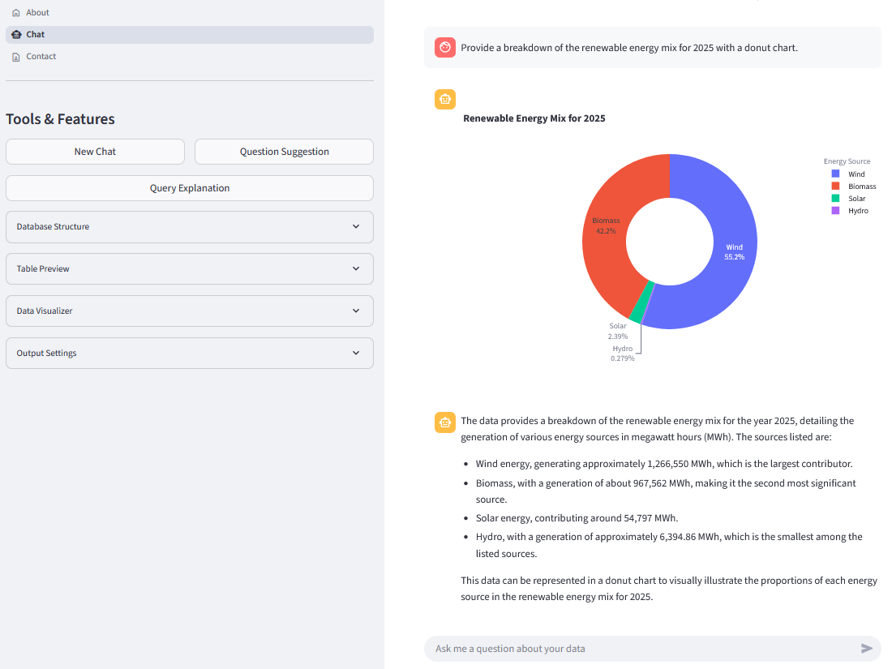
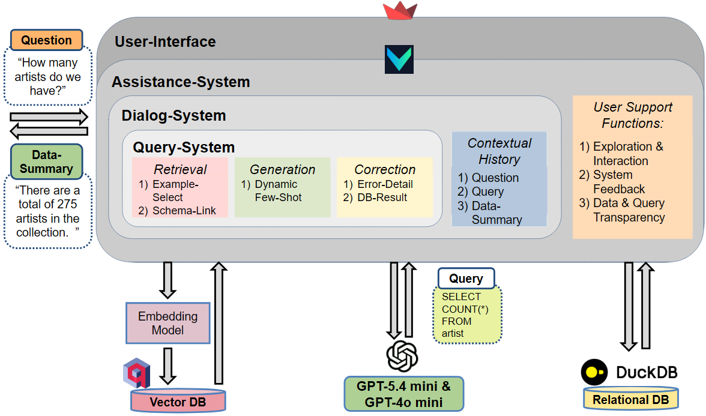
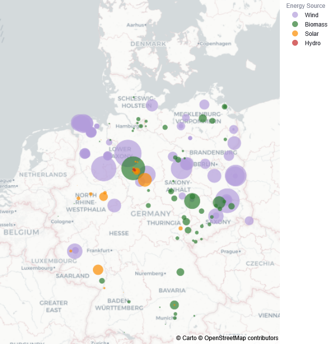

# RAG-NLIDB

A Retrieval-Augmented Generation (RAG) based **Natural Language Interface to Databases (NLIDB)** for querying relational databases using natural language.

🌐 **Live Demo:** https://rag-nlidb.streamlit.app/

## 📷 Application Overview

The application enables users to query relational databases using natural language instead of SQL. Questions are translated into executable SQL statements and the results are presented together with explanations and interactive visualizations.



## System Architecture

The application follows a modular Retrieval-Augmented Generation architecture.



The pipeline combines:

- Retrieval of relevant database schema
- Retrieval and reranking of SQL examples
- SQL generation using a language model
- Automatic query validation and correction
- Result interpretation and visualization

## Demonstration Dataset

The public demonstration uses the **Renewables-Climate Mart**, a synthetic analytical data mart modelling the renewable generation portfolio of a fictional German energy company ("Electricville").

The dataset is built from publicly available data provided by:

- German Market Master Data Register (MaStR)
- SMARD
- Open-Meteo

The complete data mart is maintained as a separate repository.

🔗 **Related Repository:** [Renewables-Climate Mart](https://github.com/ThAu-Tr/renewables-climate-mart)

## 📷 Example Analysis

**Question**

> Map the generation capacity across Germany. Summarize the portfolio by energy source, operator and city. Ensure TSO regions, GPS coordinates and asset counts are included for regional clustering.

**Result**

The query aggregates installed generation capacity from the asset dimension and combines it with company, energy source and geographic area information. The result is visualized by location and energy source to show the regional structure of the renewable portfolio.



## Repository Structure

```text
.
├── .streamlit/             Streamlit configuration
├── assets/                 Images and demonstration assets
├── database/               DuckDB database and metadata
├── ER-Diagram/             Interactive ER diagrams
├── pages/                  Streamlit application pages
├── scripts/                RAG pipeline and application logic
├── p0_streamlit_app.py     Application entry point
├── requirements.txt
└── packages.txt
```

## Deployment

This repository primarily serves as the source code for the public Streamlit demonstration.

Running the application locally requires:

- OpenAI API key
- Qdrant API key
- Qdrant instance containing the retrieval collections
- Demonstration database
- Required configuration files

After configuring the required resources:

```bash
pip install -r requirements.txt

streamlit run p0_streamlit_app.py
```